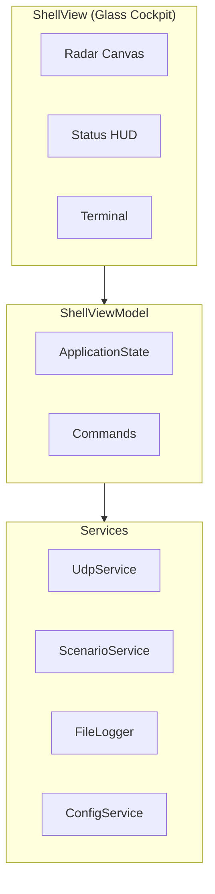

# Aegis-Link C2 v3.0.0

```
    █████╗ ███████╗ ██████╗ ██╗███████╗    ██╗     ██╗███╗   ██╗██╗  ██╗
   ██╔══██╗██╔════╝██╔════╝ ██║██╔════╝    ██║     ██║████╗  ██║██║ ██╔╝
   ███████║█████╗  ██║  ███╗██║███████╗    ██║     ██║██╔██╗ ██║█████╔╝ 
   ██╔══██║██╔══╝  ██║   ██║██║╚════██║    ██║     ██║██║╚██╗██║██╔═██╗ 
   ██║  ██║███████╗╚██████╔╝██║███████║    ███████╗██║██║ ╚████║██║  ██╗
   ╚═╝  ╚═╝╚══════╝ ╚═════╝ ╚═╝╚══════╝    ╚══════╝╚═╝╚═╝  ╚═══╝╚═╝  ╚═╝
                    TACTICAL C2 CONSOLE | v3.0.0
```

**Classification:** UNCLASSIFIED // PUBLIC RELEASE  
**Lead Systems Architect:** Mahdy Gribkov

---

## Getting Started

### UDP Listener
The application listens for UDP packets on **Port 5555** (configurable).

```powershell
# Test with PowerShell
$udp = New-Object System.Net.Sockets.UdpClient
$udp.Connect("127.0.0.1", 5555)
$bytes = [Text.Encoding]::ASCII.GetBytes('{"type":"ping","val":90}')
$udp.Send($bytes, $bytes.Length)
```

### Launch
1. Download `AegisLink.App.exe` from Releases
2. Run directly (single-file, no extraction)
3. Press `~` to open terminal, `F11` for fullscreen

---

## Architecture



### Key Components
| Component | Purpose |
|-----------|---------|
| `ShellView` | Glass Cockpit UI with full-screen radar |
| `ShellViewModel` | State machine, commands, telemetry |
| `ScenarioService` | Simulation traffic patterns |
| `CommandTokenizer` | Regex parsing for terminal commands |

---

## Keyboard Shortcuts

| Key | Action |
|-----|--------|
| `~` | Toggle Terminal |
| `F11` | Toggle Fullscreen |
| `Esc` | Close Terminal |
| `Ctrl+S` | Capture Snapshot |

---

## Terminal Commands

| Command | Description |
|---------|-------------|
| `scan` | Start UDP listener / simulation |
| `stop` | Stop listener |
| `status` | Show current state |
| `export -log` | Save logs to Documents |
| `clear` | Clear terminal |
| `help` | Show commands |

---

## Troubleshooting

### UDP Port Blocked
```powershell
# Check if port 5555 is in use
netstat -an | findstr 5555

# Open Windows Firewall
New-NetFirewallRule -DisplayName "AegisLink UDP" -Direction Inbound -Protocol UDP -LocalPort 5555 -Action Allow
```

### Application Won't Start
1. Check `%LOCALAPPDATA%\AegisLink\logs\crash.log`
2. Ensure .NET 6.0 is installed (or use self-contained build)

---

## Version History

| Version | Status | Description |
|---------|--------|-------------|
| **3.0.0** | **CURRENT** | Flagship refactor: DI, CommunityToolkit.Mvvm, Glass Cockpit |
| 2.1.0 | Stable | Active radar/graph animation |
| 2.0.2 | Stable | XAML event compatibility fix |
| 1.6.0 | Superseded | Flagship UI overhaul |

---

## License

MIT License. See [LICENSE](LICENSE) for details.
