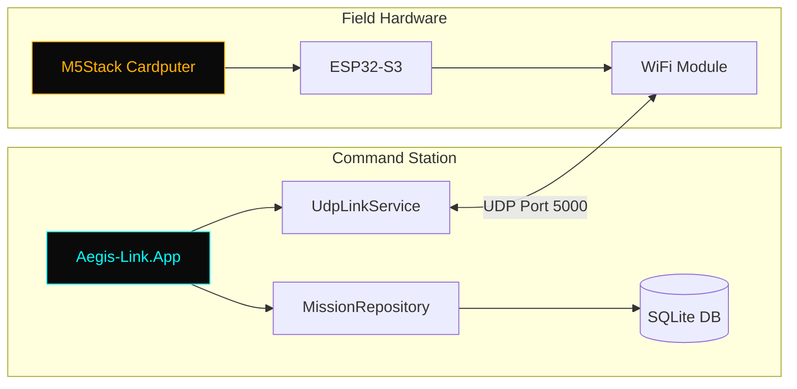

# AEGIS-LINK | Tactical C2 Interface

```
    ╔═══════════════════════════════════════════════════════════════╗
    ║     █████╗ ███████╗ ██████╗ ██╗███████╗    ██╗     ██╗███╗   ██╗██╗  ██╗    ║
    ║    ██╔══██╗██╔════╝██╔════╝ ██║██╔════╝    ██║     ██║████╗  ██║██║ ██╔╝    ║
    ║    ███████║█████╗  ██║  ███╗██║███████╗    ██║     ██║██╔██╗ ██║█████╔╝     ║
    ║    ██╔══██║██╔══╝  ██║   ██║██║╚════██║    ██║     ██║██║╚██╗██║██╔═██╗     ║
    ║    ██║  ██║███████╗╚██████╔╝██║███████║    ███████╗██║██║ ╚████║██║  ██╗    ║
    ║    ╚═╝  ╚═╝╚══════╝ ╚═════╝ ╚═╝╚══════╝    ╚══════╝╚═╝╚═╝  ╚═══╝╚═╝  ╚═╝    ║
    ║                                                                             ║
    ║              TACTICAL COMMAND & CONTROL INTERFACE                           ║
    ╚═══════════════════════════════════════════════════════════════╝
```


[](https://github.com/Mahdy-gribkov/Aegis-Link-C2-Tactical-Simulator/releases/latest)
[](LICENSE)
[](https://dotnet.microsoft.com/)

[](https://github.com/Mahdy-gribkov/Aegis-Link-C2-Tactical-Simulator/releases/latest)

---

## Mission Profile

**Aegis-Link** is a defense-grade Command & Control (C2) tactical interface for real-time telemetry integration between desktop command stations and M5Stack Cardputer field hardware.

| Capability | Description |
|------------|-------------|
| **Binary Protocol** | Zero-copy deserialization with `Pack=1` memory alignment |
| **Dual-Mode** | Seamless switching between live hardware and simulation |
| **Persistence** | SQLite-based "Black Box" mission logging |
| **Security** | XOR challenge-response endpoint authentication |

---

## System Architecture



---

## Operational Guide

### Simulation Mode (No Hardware Required)

1. **Download** the latest release from [Releases](https://github.com/Mahdy-gribkov/Aegis-Link-C2-Tactical-Simulator/releases/latest)
2. **Extract** `AegisLink-Tactical-vX.X.X.zip`
3. **Run** `AegisLink.App.exe`
4. **Enable** "SIMULATION MODE" toggle in the UI
5. **Observe** synthetic telemetry data streaming to the HUD

### Field Deployment (Hardware Required)

#### Prerequisites
- M5Stack Cardputer with ESP32-S3
- USB-C cable for flashing
- VS Code + PlatformIO extension

#### Deployment Steps
```powershell
# 1. Flash the Cardputer
cd Hardware
pio run --target upload

# 2. Connect to Cardputer WiFi
# Network: AEGIS-LINK
# Password: (configured in main.cpp)

# 3. Launch Command Station
./AegisLink.App.exe

# 4. Verify Connection
# Status indicator should show "CONNECTED"
```

---

## Key Features

### CI/CD Pipeline
- **Automated Testing** on every push
- **NuGet Caching** for 50% faster builds
- **Self-Contained Releases** with single-file deployment

### Binary Determinism
```csharp
[StructLayout(LayoutKind.Sequential, Pack = 1)]
public readonly struct TelemetryFrame
{
    public readonly int BatteryLevel;      // 4 bytes
    public readonly float SignalStrength;  // 4 bytes
    public readonly double Latitude;       // 8 bytes
    public readonly double Longitude;      // 8 bytes
    public readonly uint StatusCodes;      // 4 bytes
}                                          // Total: 28 bytes
```

### Mission Persistence
All telemetry events are logged to an SQLite database for post-mission analysis and audit trails.

---

## Hardware Requirements

| Component | Specification |
|-----------|---------------|
| **Command Station** | Windows 10/11 x64, UDP Port 5000 |
| **Field Unit** | M5Stack Cardputer (ESP32-S3), WiFi |
| **Display** | Minimum 1024x768, Recommended 1920x1080 |

---

## Build From Source

```powershell
git clone https://github.com/Mahdy-gribkov/Aegis-Link-C2-Tactical-Simulator.git
cd Aegis-Link-C2-Tactical-Simulator
dotnet restore
dotnet build --configuration Release
dotnet run --project src/App/AegisLink.App.csproj
```

---

## Documentation

| Document | Description |
|----------|-------------|
| [Design Rationale](docs/DESIGN_RATIONALE.md) | Architectural decisions |
| [Security Protocol](docs/SECURITY.md) | XOR handshake specification |
| [Architecture Guide](docs/ARCHITECTURE.md) | Binary determinism, MVVM |
| [Hardware Guide](Hardware/README.md) | Cardputer firmware flashing |
| [Dependency Manifest](docs/DEPENDENCY_MANIFEST.md) | Licenses |

---

## Version History

| Version | Status | Description |
|---------|--------|-------------|
| **1.6.0** | **CURRENT** | Flagship UI overhaul, radar visualization, security hardening |
| 1.5.0 | Stable | Active theming engine (Day/Night modes), cleaner artifacts |
| 1.4.0 | Stable | Universal protocol documentation, single-file compression |
| 1.3.0 | Stable | Field Manual documentation, UX overhaul |
| 1.2.0 | Stable | Optimized CI/CD with NuGet caching |
| 1.1.0 | Superseded | XAML hotfix, semantic versioning |
| 1.0.0 | Superseded | Initial release |

---

## Maintainer

**Mahdy Gribkov**  
Lead Systems Architect  
[GitHub](https://github.com/Mahdy-gribkov)

---

*AEGIS-LINK | Defense-Grade Tactical Awareness*
